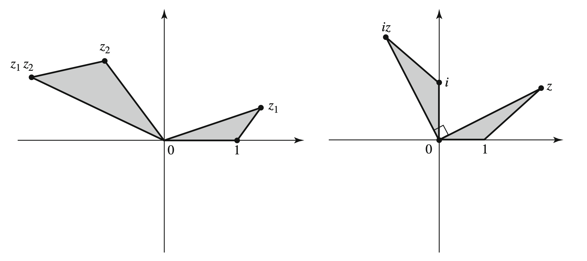

# Complex Numbers

## The Field of Complex Numbers

**Definition**: The complex field $\mathbb C$ is the set of ordered pairs $(a, b)$ with addition/multiplication given by:

$$
\begin{align*}
    (a, b) + (c, d) &= (a + c, b + d) \\
    (a, b) \cdot (c, d) &= (ac - bd, ad + bc)
\end{align*}
$$

* addition and multiplication is commmutative, associative, and the distributive property is satisfied
* $(0, 0)$ is the additive identity, and $(-a, -b)$ is the additive inverse
* multiplicative identity is $(1, 0)$
* multiplicative inverse of $(a, b)$ is $(\frac{a}{a^2 + b^2}, \frac{-b}{a^2 + b^2})$
  * obtained by solving $(a, b)(x, y) = (x, y)(a, b) = (1, 0)$ for $x$ and $y$

The set of complex numbers $\lbrace (a, 0) \mid a \in \mathbb R \rbrace \subseteq \mathbb C$ is isomorphic to the reals since
* $(a_1, 0) + (a_2, 0) = (a_1 + a_2, 0) \iff a_1 + a_2$
* $(a_1, 0) \cdot (a_2, 0) = (a_1 a_2, 0) \iff a_1a_2$

Note that $(0, 1)$ is the square root of $(-1, 0) \iff -1$ since

$$
    (0, 1) \cdot (0, 1) = (-1, 0 \cdot 1 + 1 \cdot 0) = (-1, 0) \iff -1
$$

and we write $i$ for $(0, 1)$.

Since $a(b, c) = (a, 0)(b, c) = (ab, ac)$, we can identify $(a, b)$ with $a + bi$ since

$$
    (a, b) = (a, 0) + (0, b) \iff a + bi
$$

Every complex number has two square roots.

$$
    a + bi = (x + iy)^2 = x^2 - y^2 + i(2xy)
$$

and solving the system: $a = x^2 - y^2$ and $b = 2xy$ gives

$$
x = \pm \sqrt{\frac{a + \sqrt{a^2 + b^2}}{2}}, y = (\operatorname{sgn} b) \sqrt{\frac{-a + \sqrt{a^2 + b^2}}{2}}
$$

**Example**: $\sqrt {2i} = \pm(1 + i)$

*Proof*: $\left(\pm(1 + i)\right)^2 = 1 + 2i - 1 = 2i$. $\blacksquare$

**Example**: $\sqrt{-5 - 12i} = \pm (2 - 3i)$

*Proof*: $\left( \pm (2 - 3i) \right)^2 = 4 - 12i  -9 = -5 - 12i$. $\blacksquare$

**Example**: Quadratic formula for a complex polynomial $az^2 + bz + c = 0, a, b, c \in \mathbb Z$, $a \neq 0$ is

$$
    z = \frac{-b \pm \sqrt{b^2 - 4ac}}{2a} 
$$

## The Complex Plane

The complex plane is formed by associating each complex number $a + bi$ with the point $(a, b)$ in the Cartesian plane.

The x-axis is called the **real axis** and the y-axis the **imaginary axis**.

$z_1 + z_2$ is the vector sum of $z_1$ and $z_2$.

$z_1z_2$ is the vector that forms a triangle $\triangle O,z_2,z_1z_2$ similar to $\triangle 0,1,z_1$.

**Definition**: Let $z = x + yi \in \mathbb C$. Then
* $\Re(z)$ or $\operatorname{Re}(z)$, the **real part** of $z$, is $x$.
* $\Im(z)$ or $\operatorname{Im}(z)$, the **imaginary part** of $z$, is $y$.
* $\bar z$, the **conjugate** of $z$, is $x - iy$.
* $\vert z \vert$, the **absolute value** or **modulus** of $z$ is $\sqrt{x^2 + y^2}$
* $\operatorname{Arg} z$, the **argument** of $z$, defined for $z \neq 0$, is the angle that the vector $z$ (originating from the origin) makes with the positive $x$-axis, that is

$$
    \cos \theta = \frac{\Re(z)}{\vert z \vert}, \sin \theta = \frac{\Im(z)}{\vert z \vert}
$$

* the **polar form** of $z$ is $z = r(\cos \theta + i\sin \theta)$ where $r = \vert z \vert$ and $\theta = \operatorname{Arg} z$
  * $\cos \theta + i \sin\theta$ is abbreviated as $\operatorname{cis}\theta$

Note that in the complex plane, $\bar z$ is $z$ reflected along the real-axis.

**Proposition**: Let $z_1 = r_1\operatorname{cis}\theta_1$ and $z_2 = r_2\operatorname{cis}\theta_2$. Then
* $z_1z_2 = r_1r_2\operatorname{cis}(\theta_1 + \theta_2)$
  * it follows that $z^n = r^n\operatorname{cis}(n \theta)$
* $z_1 / z_2 = (r_1 / r_2)\operatorname{cis}(\theta_1 - \theta_2)$

**Example**: Find the cube roots of $1$ in $\mathbb C$.

We have $r^3 \operatorname{cis} 3\theta = 1 \operatorname{cis} 0$, so

$$
    z_1 = \operatorname{cis} 0, z_2 = \operatorname{cis} \frac{2\pi}{3}, z_3 = \operatorname{cis} \frac{4\pi}{3}
$$

Note that $z_1, z_2, z_3$ form an equilateral triangle inscribed in the unit circle.

**Example**: The $n$-roots of $1$ form an $n$-gon inscribed in the unit circle.